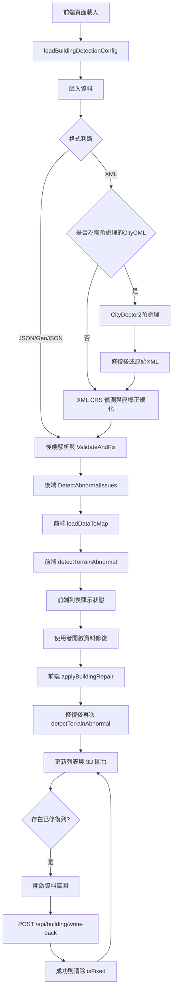
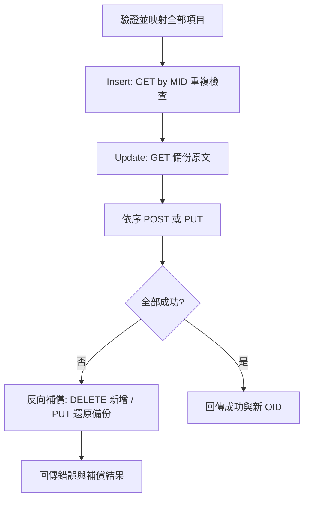

# 資料狀態、修復與寫回開發文件

## 文件目的
本文件整理目前專案中「資料狀態判斷」、「資料修復」與「寫回外部資料庫」的既有實作，方便開發者快速理解匯入、檢核、修復、寫回與畫面呈現之間的關係。

相關實作主要分布於：

- `Demo_3dDatasCheck_VueTsAspNetCore10.Server/appsettings.json`（異常檢測閾值、`ModelOfBuildingApi` 寫回 URL）
- `Demo_3dDatasCheck_VueTsAspNetCore10.Server/Options/BuildingAbnormalDetectionOptions.cs`
- `Demo_3dDatasCheck_VueTsAspNetCore10.Server/Options/ModelOfBuildingApiOptions.cs`
- `Demo_3dDatasCheck_VueTsAspNetCore10.Server/Services/BuildingProcessorService.cs`
- `Demo_3dDatasCheck_VueTsAspNetCore10.Server/Services/WriteBackService.cs`
- `Demo_3dDatasCheck_VueTsAspNetCore10.Server/Models/WriteBackModels.cs`
- `Demo_3dDatasCheck_VueTsAspNetCore10.Server/Controllers/BuildingController.cs`（`GET /api/building/detection-settings`、`POST /api/building/write-back`）
- `demo_3ddatascheck_vuetsaspnetcore10.client/src/utils/buildingDetectionConfig.ts`
- `demo_3ddatascheck_vuetsaspnetcore10.client/src/components/BuildingCheckDialog.vue`
- `demo_3ddatascheck_vuetsaspnetcore10.client/src/components/BuildingDemo.vue`
- `demo_3ddatascheck_vuetsaspnetcore10.client/src/components/DataRepairDialog.vue`
- `demo_3ddatascheck_vuetsaspnetcore10.client/src/components/DataWriteBackDialog.vue`
- `demo_3ddatascheck_vuetsaspnetcore10.client/src/utils/buildingRepair.ts`
- `demo_3ddatascheck_vuetsaspnetcore10.client/src/types/BuildingPart.ts`

## 1. 核心資料欄位
前端與後端目前沒有共用的狀態列舉，畫面上的狀態名稱是由以下欄位組合推導而成：

- `isAbnormal`：是否被判定為垂直幾何異常（含離地浮空、層高異常、斷層、重疊、倒置等）
- `isValid`：資料是否有效
- `isFixed`：資料是否曾被自動修復或互動修復
- `errorMessages`：異常訊息清單
- `fixMessages`：修復訊息清單

其中前端型別定義位於 `demo_3ddatascheck_vuetsaspnetcore10.client/src/types/BuildingPart.ts`。

### 1.1 匯入格式與幾何正規化
`BuildingProcessorService.ProcessContent()` 目前會先依內容前綴自動分流：

- `[` / `{`：JSON
- `<`：XML

其中 JSON 與 XML 在進入後續驗證前，都會先被正規化成相同的 `coordinates: number[][][]` 結構，再交由 `ValidateAndFix()` 與 `DetectAbnormalIssues()` 共用。

需特別注意：前端 Cesium、地形檢測與修復工具都假設 `coordinates` 的每個點都是 **`[lon, lat, z]`（WGS84 經緯度 + 高程）**。因此 XML/GML 若原始提供的是平面投影座標（例如台灣常見的 TWD97 / TM2），後端會在 XML 正規化階段先轉成 WGS84，再交給後續流程。

自 CityGML 預處理重構後，XML 路徑會先經過一層「是否需要 CityDoctor2」的前置判斷：

1. 解析為 XML 後，先判斷是否為 CityGML 文件
2. 若不是 CityGML，沿用既有寬鬆 XML 匯入流程
3. 若是 CityGML 且偵測到 `lodXSolid` / `lodXMultiSurface` / `gml:Polygon` 等拓撲相關幾何節點，則先嘗試以 CityDoctor2 進行拓撲預處理
4. 預處理成功時，使用修復後的 XML 進入既有正規化流程
5. 預處理停用、失敗、逾時或未產出結果時，回退使用原始 XML，仍繼續既有匯入流程

也就是說，CityDoctor2 目前是 **CityGML 專用且可選的前置處理**，不會改變 JSON、GeoJSON、舊版 XML、地政 XML 的主流程。

目前後端支援的匯入來源如下：

| 來源格式 | 幾何來源 | 正規化方式 |
| --- | --- | --- |
| 舊版 JSON 陣列 | `boundedBy` JSON 字串 | 直接反序列化為 `List<List<List<double>>>` |
| GeoJSON FeatureCollection | `geometry.coordinates` | 由 `GeoJsonSolidInflator` 轉成既有 3D polygon 陣列；必要時自動補成立體 |
| 舊版 XML | `<boundedBy>` 內的 JSON 字串 | 與舊版 JSON 相同，直接反序列化 |
| BuildingFloor XML | `WallSurface` / `FloorSurface` / `CeilingSurface` JSON | 合併各表面多邊形為既有 3D polygon 陣列 |
| CityGML / 地政 XML | `gml:Polygon` / `gml:posList` / `gml:pos` | 逐一讀取點列，必要時依 CRS 轉換為 `[lon, lat, z]` polygon 陣列 |

CityGML / 地政 XML 路徑另外有以下相容規則：

- XML 節點比對以 `local-name` 為準，忽略 namespace prefix 與大小寫差異。
- 會辨識 `ConsistsOfBuildingPart`、`BuildingRegistration`、`產權建物`、`建物產權空間`、`BuildingFloor` 等常見建物節點。
- `BuildingFloor` 若無 `boundedBy`，會改讀 `WallSurface`、`FloorSurface`、`CeilingSurface`（內嵌 JSON 多邊形陣列），並依牆→地板→天花板順序合併。
- `MID` / `OID` 缺漏時，會優先使用 `gml:id`；若仍無法取得，才會用 `建號母號 + 層次` 或流水號組出 fallback 識別值。
- `gml:posList` 若是 2D 座標，後端會自動補 `z = 0`，讓後續流程仍可沿用既有 3D 幾何處理。
- `srsName` 會優先從 `posList` / `pos`、`LinearRing`、`Polygon`、`MultiSurface`、`boundedBy` 與祖先節點中查找。
- 若 XML 未提供 `srsName`，後端會先判斷是否已落在經緯度範圍；若數值明顯像台灣 TM2 平面座標，則會以啟發式推定為 `TWD97 / TM2 zone 121 (EPSG:3826)` 並自動轉成 WGS84。
- 若偵測到目前未支援的 CRS，會保留原始座標並附上匯入提示，方便後續人工確認。

## 2. 資料狀態判斷邏輯

### 2.1 狀態來源
畫面上顯示的 `正常`、`異常`、`錯誤`、`已修復`，是由 `demo_3ddatascheck_vuetsaspnetcore10.client/src/components/BuildingCheckDialog.vue` 的 `getBuildingCategory()` 與列表 badge 顯示邏輯決定。

實際判斷順序如下（與 `BuildingCheckDialog.vue` 列表 badge 一致）：

1. `isAbnormal === true` 時顯示為 `異常`
2. 否則若 `isValid === true && isFixed === false` 時顯示為 `正常`（若 `fixMessages` 含「樓層提示」則顯示 `正常（有提示）`）
3. 否則若 `isFixed === true` 時顯示為 `已修復`
4. 其餘情況顯示為 `錯誤`

也就是說，目前 UI 的優先序為：

`異常` > `正常`（含有提示）> `已修復` > `錯誤`

> 排序用的 `getBuildingCategory()` 順序為 `異常` > `錯誤` > `已修復` > `正常`，與 badge 顯示優先序不同，僅影響列表排序。

### 2.2 狀態對照表

| 顯示狀態 | 主要條件 | 說明 |
| --- | --- | --- |
| `正常` | `!isAbnormal && isValid && !isFixed` | 資料有效，且未被標記為異常，也沒有修復紀錄 |
| `異常` | `isAbnormal` | 只要被標記為垂直幾何異常，就會優先顯示為異常 |
| `錯誤` | `!isAbnormal && !isFixed && !isValid` | 資料無效，但不屬於異常，也尚未被修復 |
| `已修復` | `!isAbnormal && isFixed` | 曾被後端或前端修復，且目前未被標記為異常 |

### 2.3 正常
`正常` 代表資料沒有被後端或前端檢測為異常，且也沒有修復紀錄。常見來源如下：

- `BuildingProcessorService.ValidateAndFix()` 驗證後未發現缺漏或幾何問題
- `BuildingProcessorService.DetectAbnormalIssues()` 未判定為垂直幾何異常
- `BuildingDemo.detectTerrainAbnormal()` 未因地形高差再次標記為異常

### 2.4 異常
`異常` 對應 `isAbnormal = true`，涵蓋多種垂直幾何異常，包含離地浮空、樓層高度異常、垂直斷層、垂直重疊、樓層高度倒置與樓層號缺漏。

#### 後端會標記為異常的情況
後端在 `Demo_3dDatasCheck_VueTsAspNetCore10.Server/Services/BuildingProcessorService.cs` 中，透過 `DetectAbnormalIssues()` 呼叫以下檢測。閾值由 `appsettings.json` 的 `BuildingAbnormalDetection` 區段設定，並經 `BuildingAbnormalDetectionOptions` 注入服務（修改設定後需重啟後端才會生效）。

| 設定鍵 | 預設值 | 用途 |
| --- | --- | --- |
| `MinFloorHeight` | `2.0` m | 單層高度下限 |
| `MaxFloorHeight` | `8.0` m | 單層高度上限 |
| `GroundFloorBottomThreshold` | `5.0` m | 一般 1 樓底部離地容許上限（疑似浮空） |
| `MaxFloorGap` | `3.0` m | 相鄰樓層垂直斷層落差上限 |
| `FloorGapTolerance` | `0.5` m | 相鄰樓層垂直重疊容許量 |
| `MaxVerticalShiftMeters` | `20.0` m | 單次垂直重疊修正最大位移（物理把關） |
| `UndergroundTolerance` | `0.5` m | regular 樓層底部可略低於地形（物理把關） |

- `DetectSinglePartAbnormal()`
  - 樓層高度低於 `MinFloorHeight`
  - 樓層高度高於 `MaxFloorHeight`
  - 一般 1 樓底部高度高於 `GroundFloorBottomThreshold`
- `CompareAdjacentFloors()`
  - 相鄰樓層落差大於 `MaxFloorGap`，標記為垂直斷層
  - 相鄰樓層重疊超過 `FloorGapTolerance`，標記為垂直重疊
  - 上層底部低於下層底部，標記為樓層高度倒置
- `DetectMissingFloorNumbers()`
  - 同建號內一般地上樓層（regular，如 `001`／`1F`）編號缺漏時處理；不掃描地下室（B1）或屋頂層（R01）
  - **缺地下層（單層建號 → 僅提示）**：建號內只有一個 regular 樓層號且該號 > 1（例如僅有 `002`）時，寫入 `FixMessages` 的「樓層提示：未列入樓層缺漏——…」（說明視覺浮空／缺較低樓層但可能因區分所有／每層不同建號），**不**設定 `IsAbnormal`，也不進入異常／修復清單
  - **缺地下層（多層建號 → 異常）**：建號內有多個 regular 樓層且最低號 > 1（例如 `002`+`003` 而無 `001`）時，對最低現有樓層 `MarkAbnormal`「缺地下層／缺少 `001`…」
  - **中間跳號（異常）**：相鄰現有樓層號之間有缺號（例如 `001` 與 `003` 缺 `002`）時，對缺號兩端樓層標記「缺少 `002` 樓」

上述異常情況都會透過 `MarkAbnormal()`：

- 設定 `IsAbnormal = true`
- 設定 `IsValid = false`
- 將異常訊息寫入 `ErrorMessages`

單層建號的「樓層提示」僅寫入 `FixMessages`，狀態仍為 `正常`，列表會顯示：

- 狀態徽章：`正常（有提示）`
- 「訊息」欄：完整提示文案（含「未列入樓層缺漏」原因）
- 地圖資訊框另有「提示資訊」欄

> 注意：「垂直斷層」依 Z 軸落差判定，「樓層缺漏」異常依樓層號判定（多層缺地下層與中間跳號）；單層建號缺較低樓層則降為提示。

#### 前端會補充標記為異常的情況
前端在 `demo_3ddatascheck_vuetsaspnetcore10.client/src/components/BuildingDemo.vue` 的 `detectTerrainAbnormal()` 中，會使用 Cesium 地形取樣補做一次判斷：

- 若 `建物最低高程 - 地形高度 > 3.0m`（此值目前仍為前端常數 `GROUND_FLOAT_TOLERANCE`，與後端 `BuildingAbnormalDetection` 無關）
- 則由 `markTerrainAbnormal()` 將該筆資料標記為異常

此時也會：

- 設定 `isAbnormal = true`
- 設定 `isValid = false`
- 追加一筆描述地形落差的 `errorMessages`（訊息內容仍可能包含「疑似浮空」等具體描述）

### 2.5 錯誤
`錯誤` 代表資料本身無效，但目前沒有被歸類為異常，也沒有修復完成。這類資料通常來自後端驗證階段的資料品質問題。

常見情況如下：

- `BoundedByRaw` 完全缺漏
- 座標 JSON 解析失敗（舊版 `boundedBy` 文字格式）
- 座標資料只含空值或點數不足
- 座標中含有無效點，過濾後仍留下資料瑕疵

這些情況多由 `ValidateAndFix()` 設定 `IsValid = false`，但不一定會設定 `IsFixed = true`。

### 2.6 已修復
`已修復` 代表資料有修復紀錄，且目前未被標記為異常。

#### 後端自動修復
`ValidateAndFix()` 會在下列情況設定 `IsFixed = true` 並寫入 `FixMessages`：

- 建號缺漏時，自動補成 `UNKNOWN_NO`
- 樓層缺漏時，自動補成 `001`
- 多邊形未閉合時，自動補上終點形成閉合幾何

另外，GeoJSON 匯入流程中的 `GeoJsonSolidInflator.ApplyInflateFixMessages()` 也可能補上修復訊息，表示平面樓板已被轉成可用的 3D 幾何。

#### 前端互動修復
前端在 `demo_3ddatascheck_vuetsaspnetcore10.client/src/utils/buildingRepair.ts` 中執行修復後，也會設定 `isFixed = true` 並追加 `fixMessages`，例如：

- `缺漏樓層補齊：已補齊缺漏樓層 XXX`／`已補垂直空缺樓層 PATCH_Vxx`
- `位移修補：已水平對齊參考樓層`
- `相鄰水平修補：已水平對齊下層`
- `垂直重疊修補：已下移對齊錨點樓層 XXX`／`已上移對齊錨點樓層 XXX`／`已上移對齊下層`

- `位移修補：已垂直對齊鄰層`
- `地形貼地修補`（位移模式勾選地形貼地時）

#### 寫回後狀態變化
成功寫回外部資料庫後，前端會對已寫回列清除 `isFixed` 與 `fixMessages`（見第 9 節）。因此寫回成功的資料會從 `已修復` 變回 `正常`（若仍無異常），「資料寫回」按鈕也會在沒有剩餘已修復列時隱藏。

## 3. 狀態判斷流程



### 3.1 異常檢測閾值同步
後端與前端修復邏輯共用的垂直連續性閾值（`FloorGapTolerance`、`MaxFloorGap` 等）以 `appsettings.json` 為單一來源：

1. 後端啟動時透過 `IOptions<BuildingAbnormalDetectionOptions>` 綁定 `BuildingAbnormalDetection` 區段
2. 前端在 `BuildingDemo.vue` 的 `onMounted` 呼叫 `loadBuildingDetectionConfig()`，向 `GET /api/building/detection-settings` 取得並快取設定
3. `buildingRepair.ts` 的 `clearResolvedVerticalErrors()`、`applyAdjacentFloorHorizontalAlignment()`、`applyVerticalOverlapRepair()` 等透過 getter 讀取快取值；API 失敗時使用與後端相同的內建預設值

調整閾值時，請修改 `Demo_3dDatasCheck_VueTsAspNetCore10.Server/appsettings.json` 後重啟後端，並重新載入前端頁面即可同步。

## 4. 資料修復邏輯

### 4.1 修復入口與執行位置
目前**互動式修復**流程主要在前端執行，沒有獨立的後端修復 API。修復完成後若需持久化，另走「資料寫回」（第 9 節）由後端代理呼叫外部 ConsistsOfBuildingParts API。

需注意：CityDoctor2 的 CityGML 拓撲預處理雖然發生在後端匯入前段，但其定位是 **匯入前幾何清理**，不是取代既有前端互動修復。匯入完成後，仍沿用原本的垂直異常檢測、地形複檢與互動畫面修復。

執行路徑如下：

1. 使用者在 `BuildingCheckDialog.vue` 開啟 `DataRepairDialog.vue`（僅當存在異常樓層時顯示「資料修復」按鈕）
2. `DataRepairDialog.vue` 組出 `RepairRequest`
3. `BuildingDemo.vue` 的 `handleRepairBuildings()` 呼叫 `applyBuildingRepair()`
4. 修復完成後重新執行 `detectTerrainAbnormal()`
5. 重新渲染圖台與列表，並顯示修復摘要
6. （可選）若出現「已修復」列，可再開啟「資料寫回」寫入外部資料庫

### 4.2 修復對象
`DataRepairDialog.vue` 目前只會列出 `isAbnormal === true` 的資料：

- `.filter((b) => b.isAbnormal && b.rowId)`

這代表目前可由互動畫面修復的對象，限於被歸類為 `異常` 的樓層；純 `錯誤` 狀態的資料不會出現在修復清單中。

### 4.3 修復請求欄位
`RepairRequest` 定義於 `demo_3ddatascheck_vuetsaspnetcore10.client/src/utils/buildingRepair.ts`，主要欄位如下：

- `mode`
  - `gapRepair`
  - `displacement`
- `selectedRowIds`：使用者勾選的樓層
- `maxMissingFloors`：缺漏樓層補齊時允許補齊的缺漏層數上限
- `gapRepairStrategy`：缺漏樓層補齊策略
  - `floorNumberGap`：樓層號跳號才補（預設）
  - `verticalGap`：垂直空缺一律補
- `horizontalCorrection`：位移修正是否啟用水平修正
- `adjacentFloorHorizontalCorrection`：位移修正是否啟用相鄰樓層水平對齊（僅經緯度）
- `verticalOverlapCorrection`：位移修正是否啟用垂直重疊修正（僅 Z 軸）
- `verticalCorrection`：位移修正是否啟用垂直修正
- `terrainGrounding`：位移修正是否啟用地形貼地（將錨點樓層貼齊地形後整棟下移，預設關閉）

## 5. 缺漏樓層補齊邏輯

### 5.1 目的
缺漏樓層補齊對應 `applyGapRepair()`，依使用者選擇的 `gapRepairStrategy` 補齊同建號建物中的缺漏樓層。

### 5.2 補齊策略

| 策略 | 代碼 | 觸發條件 |
|------|------|---------|
| 樓層號跳號才補 | `floorNumberGap` | 一般地上樓層（regular）編號有缺層，例如 001 與 003 之間缺 002 |
| 垂直空缺一律補 | `verticalGap` | 物理相鄰樓層之間 Z 軸落差大於 `MaxFloorGap`（預設 3.0m），樓層號可連續 |

### 5.3 處理流程（共通）

1. 複製原始建物資料，避免直接污染輸入
2. 依 `buildingNo` 分組，僅處理「至少有一筆已勾選異常樓層」的建號群組
3. 依策略偵測缺漏並建立補齊樓層
4. 將新樓層加入結果清單
5. 呼叫 `clearResolvedVerticalErrors()` 清除已解決的垂直斷層／重疊訊息

### 5.4 策略 A：樓層號跳號（`applyFloorNumberGapRepair`）

1. 掃描建號內**全部樓層**（非僅已勾選異常樓層）
2. 僅以 `regular` 類樓層參與缺號計算（排除 B1、R01 等，避免與 001 數字衝突）
3. 在已勾選異常樓層的 regular 編號區間內，找出不存在的缺號
4. 連續缺號區段長度超過 `maxMissingFloors` 則跳過該區段
5. 插入前檢查該樓層號是否已存在，避免重複補層
6. 高度以缺號上下最近的 regular 樓層之 `maxHeight`／`minHeight` 之間的空隙，**僅均分給缺號樓層數**（`span / missingCount`）；無法推算時使用預設層高 `3.0m`。例如 001 頂 `3.2`、003 底 `6.4` 且只缺 002 時，補層槽位為 `3.2~6.4`（不會再除以 N+1 留下半段空缺）
7. 補齊樓層命名為三位數，例如 `002`

### 5.5 策略 B：垂直空缺（`applyVerticalGapRepair`）

1. 依 `compareFloors` 排序建號內全部樓層，檢查物理相鄰對
2. 僅當相鄰對**至少一端**為已勾選異常樓層時才處理
3. 若 `upper.minHeight - lower.maxHeight > MaxFloorGap`，判定為垂直斷層
4. 補層數：`max(1, ceil(gap / 3.0) - 1)`；超過 `maxMissingFloors` 則跳過
5. 在斷層區間均分高度槽位
6. 補齊樓層命名為 `PATCH_V01`、`PATCH_V02`…（區段內遞增，避免與既有樓層衝突）

### 5.6 補齊樓層建立方式
補齊樓層由 `createPatchedBuilding()` 建立，主要特性如下：

- 以鄰近樓層作為幾何模板（`pickPatchTemplate` 優先選有座標、非異常、footprint 較大者）
- 模板無有效座標時不建立補層
- 複製原有座標後，透過 `shiftCoordinatesZ()` 線性調整高度
- **`MID`** 沿用同建號模板樓層的 `mid`（與同棟資料一致）
- **`OID`** 為新建唯一值（`PATCH_建號_樓層_xxxx`），方便區分補齊紀錄；`rowId` 亦為新建 UUID
- 新增資料會直接標記為：
  - `isValid = true`
  - `isFixed = true`
  - `isAbnormal = false`
- 修復訊息：
  - 號碼缺層：`缺漏樓層補齊：已補齊缺漏樓層 XXX`
  - 垂直補層：`缺漏樓層補齊：已補垂直空缺樓層 PATCH_Vxx`

### 5.7 跳過條件
以下情況不會補齊：

- 建號內無已勾選異常樓層
- 樓層號跳號模式：區間內無缺號，或連續缺號超過 `maxMissingFloors`
- 垂直空缺模式：落差未超過 `MaxFloorGap`，或相鄰對兩端均未勾選
- 補層數超過 `maxMissingFloors`
- 目標樓層號／標籤已存在
- 上下鄰層無可用幾何模板

修復摘要中會統計：

- `insertedCount`：實際補齊筆數
- `skippedGaps`：因超過上限而跳過的區段數
- `skippedNoTemplate`：因無可用模板而跳過的區段數

### 5.8 修復後異常清除
`applyBuildingRepair()` 在缺漏樓層補齊完成後會呼叫 `clearResolvedVerticalErrors()`，重新檢核同建號相鄰樓層的垂直連續性，並移除已解決的「垂直斷層」「垂直重疊」訊息。

## 6. 位移修正邏輯

### 6.1 目的
位移修正對應 `applyDisplacementRepair()`，用來處理已標記為異常的樓層位置偏移問題。它可以依使用者勾選，分別執行：

- 水平修正
- 相鄰樓層水平對齊
- 垂直重疊修正
- 垂直修正

### 6.2 執行順序
`applyDisplacementRepair()` 固定依下列順序執行：

1. 水平修正
2. 相鄰樓層水平對齊
3. 垂直重疊修正
4. 垂直修正

建議以資料可信度為優先時，分步勾選並檢視每步結果；若懷疑平面偏移，先做水平或相鄰樓層水平對齊，再視需要做垂直重疊或垂直修正。

### 6.2.1 Footprint 子棟分群（同建號多構件）

同建號內若含**多個獨立 footprint**（例如兩個不同位置的 `001`、多個分散的 `R01`、或主棟與附屬物），後端檢測與前端修復皆會先依水平 footprint 重疊關聯分子棟（`BuildingFootprintClusterer` / `buildingFootprintCluster.ts`），再於各子棟內進行垂直連續性判斷與修復。

分群規則（前後端對齊）：

- 兩筆建物 footprint 的 bbox 相交，且交集面積 ÷ 較小 footprint 面積 ≥ `0.2` → 視為同一子棟
- **同樓層標籤**（如兩筆 `001`）即使 Z 相同，也不做「上下層」垂直重疊比較
- 垂直重疊修正、水平參考樓層、缺樓層號檢測，皆在子棟範圍內運作，避免把整個建號串成單一 Z 軸柱體

### 6.3 水平修正
水平修正由 `applyHorizontalDisplacementRepair()` 執行，邏輯如下：

1. 只處理 `isAbnormal = true` 且被選取的樓層
2. 在同一 `buildingNo`、**同一 footprint 子棟**中尋找非異常樓層作為參考樓層
3. 以目標樓層與參考樓層的質心差，計算平移量
4. 若平移距離大於 `100m`，則忽略該參考樓層
5. 計算平移後 footprint 與參考樓層 footprint 的重疊比例
6. 選擇重疊比例最高的參考方案
7. 只有當重疊比例至少達到 `0.5` 才套用修復

修復成功後會：

- 平移經緯度，不改變 Z 值
- 重新計算高度範圍
- 設定 `isFixed = true`
- 寫入 `位移修補：已水平對齊參考樓層`

### 6.4 相鄰樓層水平對齊
相鄰樓層水平對齊由 `applyAdjacentFloorHorizontalAlignment()` 執行，以相鄰樓層 Z 軸重疊為觸發條件，將已選取異常樓層水平對齊相鄰鄰層（不調整 Z 值）。

處理方式如下：

1. 依建號分組並按樓層排序
2. 逐組檢查相鄰樓層是否出現 `gap < -FloorGapTolerance`
3. 若上層為已選取異常樓層，則將上層水平對齊下層
4. 否則若下層為已選取異常樓層，則將下層水平對齊上層
5. 平移距離不得超過 `100m`，且平移後 footprint 與參考鄰層的重疊比例至少達 `0.5`

修復成功後會：

- 平移經緯度，不改變 Z 值
- 設定 `isFixed = true`
- 寫入 `相鄰水平修補` 訊息

本步驟不會清除「垂直重疊」錯誤訊息。

### 6.5 垂直重疊修正
垂直重疊修正由 `applyVerticalOverlapRepair()` 執行，目標是解決相鄰樓層在 Z 軸上的重疊，並以**整棟連續重堆疊**避免只移部分樓層造成建物破碎；同時優先「下沉重堆疊」減少上浮。

處理方式如下：

1. 依建號分組，再依 footprint 分子棟；各子棟內按樓層排序
2. 檢查是否存在 `gap < -FloorGapTolerance` 的相鄰對（閾值與後端 `BuildingAbnormalDetection.FloorGapTolerance` 同步，預設 `-0.5m`）；**同樓層標籤的相鄰對跳過**；若無重疊則跳過該子棟
3. 若該子棟重疊涉及樓層中**至少有一筆已勾選**，才處理該子棟；否則跳過
4. 對整棟同時規劃兩種目標高度：
   - **上堆方案**：以整棟底部錨點為底（優先：未勾選的最低 regular → 最低 regular → 排序後最低樓層），向上／向下連續堆疊
   - **下沉方案**：以整棟頂部錨點為頂（優先：未勾選的最高 regular → 最高 regular → 排序後最高樓層），向上／向下連續堆疊
5. 評分後擇一（計入整棟會移動的樓層）：優先最小化上移量 `sum(max(0, dZ))`，其次最小化 `sum(|dZ|)`，再同分選下沉方案
6. 對該建號**每一層**套用目標 Z（錨點不移動）；未勾選樓層若需位移也一併移動，以維持連續堆疊
7. 若兩方案皆無法規劃，退回逐對修正：該對只要有一端已勾選即可修正，並允許移動未勾選的一端；取最小位移，同距離優先下移

修復成功後會：

- 調整整棟樓層的 Z 值（錨點樓層保持不動）
- 設定 `isFixed = true`（含為維持連續而被移動的未勾選樓層）
- 寫入 `垂直重疊修補` 訊息（含上移／下移對齊錨點樓層，或逐對時的相鄰樓層說明）

之後會呼叫 `clearResolvedVerticalErrors()`，重新檢查是否可以移除已解決的垂直異常訊息。

#### 6.5.1 地形貼地（可選後處理）
若勾選 `terrainGrounding`，在位移修正完成後、`detectTerrainAbnormal` 之前，於 `BuildingDemo.vue` 執行：

1. 對每建號取錨點樓層質心，以 Cesium 地形取樣取得地面 Z
2. 若 `anchor.minZ - groundZ > GroundFloorBottomThreshold`，將同建號全部樓層統一下移 `groundZ - anchor.minZ`
3. 寫入 `地形貼地修補` 訊息

UI 上勾選「垂直重疊修正」時會自動勾選「地形貼地」（可手動取消）。建議保留兩者一併執行，讓下沉重堆疊後若 1F 仍離地，再由地形貼地整棟下移。

#### 6.5.2 物理把關（套用前驗證）

垂直重疊修正套用前會由 [`repairPhysicsGuard.ts`](demo_3ddatascheck_vuetsaspnetcore10.client/src/utils/repairPhysicsGuard.ts) 驗證規劃結果；**不合格則整棟跳過**，不寫入 `isFixed`、不修改幾何。

驗證規則（閾值與 `BuildingAbnormalDetection` 同步，並含下列新增項）：

| 規則 | 說明 |
| --- | --- |
| 相鄰連續 | 相鄰樓層 `gap` 須在 `[-FloorGapTolerance, MaxFloorGap]` |
| 層高合理 | 每層高度在 `[MinFloorHeight, MaxFloorHeight]` |
| 堆疊順序 | 樓層由低到高 `minZ` 嚴格遞增 |
| 單次位移上限 | 任一楼層 `\|dZ\|` ≤ `MaxVerticalShiftMeters`（預設 20m） |
| 禁止穿地 | 最低 regular 樓層 `minZ` ≥ `groundZ - UndergroundTolerance`（預設 0.5m） |

流程：

1. `BuildingDemo.vue` 在垂直重疊修正前，以錨點樓層質心取樣地形，組成 `groundZByBuildingNo` 傳入修復請求
2. `chooseVerticalRestackPlan` 僅在通過物理把關的上堆／下沉方案中擇一
3. 兩方案皆不合格時嘗試逐對 fallback（每對修正前亦驗證）；仍無法修正則累計 `physicsRejectedCount`
4. 修復摘要會顯示 `物理把關跳過 N 棟`；若未取得地形則註明「未取得地形，未檢查穿地」

### 6.6 垂直修正
垂直修正由 `applyVerticalDisplacementRepair()` 執行，目標是讓異常樓層沿 Z 軸對齊相鄰的正常樓層。

處理邏輯如下：

1. 解析目前樓層號碼
2. 在同建號資料中尋找前一層與下一層的非異常參考樓層
3. 若上下參考樓層都存在，且中間可容納目前樓層高度，則優先使用上下鄰層夾出的空間
4. 若只有下層存在，則將本樓層底部對齊下層頂部
5. 若只有上層存在，則將本樓層頂部對齊上層底部

修復成功後會：

- 整體平移 Z 值
- 重新計算高度範圍
- 設定 `isFixed = true`
- 寫入 `位移修補：已垂直對齊鄰層`

最後同樣會由 `clearResolvedVerticalErrors()` 重新檢查並清除已解決的垂直異常。

### 6.7 清除已解決垂直異常
`clearResolvedVerticalErrors()` 會對同一建號：

1. 呼叫 `refreshVerticalContinuityErrors()`：先清除既有的 `垂直重疊`／`垂直斷層`／`樓層高度倒置` 訊息，再依**目前樓層號排序後的相鄰對**重算並寫回仍成立的異常。因此補入中間樓層後，原本「001 與 003 垂直斷層」這類已非相鄰的舊訊息會被拿掉，不會卡在清單上。
2. 呼叫 `refreshMissingFloorNumberErrors()`：清除舊的 `樓層缺漏`／`樓層提示` 後，依目前 regular 樓層號重新標記（單層缺較低樓層僅提示；多層缺地下層與中間跳號才標異常）。缺號已補齊時，樓層缺漏訊息會一併消失。

若某筆資料的 `errorMessages` 被清空，則會同步：

- 設定 `isAbnormal = false`
- 設定 `isValid = true`

這也是某些資料從 `異常` 轉為 `已修復` 或 `正常` 的關鍵步驟。

## 7. 修復完成後的後續處理
在 `BuildingDemo.vue` 的 `handleRepairBuildings()` 中，前端會在修復後：

1. 以修復結果覆蓋目前 `buildings`
2. 補齊 `rowId`、`errorMessages`、`fixMessages`
3. 再次執行 `detectTerrainAbnormal()`
4. 重新渲染 3D 建物
5. 顯示修復摘要對話框

這表示即使某筆資料剛完成幾何修復，只要它仍然與地形高差過大，仍可能再次被標記為 `異常`。

## 8. 目前實作限制與注意事項

### 8.1 `isAbnormal` 的語意範圍
`isAbnormal` 涵蓋以下垂直幾何異常類型：

- 離地浮空（含地形落差檢測）
- 樓層高度異常
- 垂直斷層
- 垂直重疊
- 樓層高度倒置
- 樓層缺漏（多層建號缺地下層／中間跳號；單層建號僅「樓層提示」不進異常）

畫面顯示的「異常」與程式欄位 `isAbnormal` 已一致；`errorMessages` 中的具體描述（如「疑似浮空」）則保留各異常類型的細節說明。

### 8.2 修復主要在前端
目前互動式修復流程完全在前端完成，後端負責的修復僅限於匯入階段的基本清理、自動補值，以及 CityGML 專用的可選 CityDoctor2 拓撲預處理。

### 8.3 XML CRS 正規化的狀態影響

- 若 XML/GML 明確宣告 `srsName`，後端會依該 CRS 將幾何正規化為 WGS84 `lon/lat/z`
- 若未宣告 `srsName`，但數值範圍顯示為台灣常見 TM2 投影座標，後端會自動轉換，並在 `fixMessages` 加上座標系統推定訊息
- 若 CRS 不受支援，後端會保留原始座標並附加匯入提示；此情況可能導致前端上圖異常，需人工確認來源資料

### 8.4 CityDoctor2 前置處理的狀態影響

- 若 CityDoctor2 成功修復並輸出新 XML，後端會在各筆資料的 `fixMessages` 補上 `CityGML 拓撲預處理` 訊息，並標記 `isFixed = true`
- 若 CityDoctor2 被停用、設定不完整、逾時或失敗，會回退至原始 XML 繼續匯入；此類訊息僅作為匯入提示，不會直接把資料標記為 `異常`
- 後續是否顯示為 `異常`，仍由 `ValidateAndFix()`、`DetectAbnormalIssues()` 與前端 `detectTerrainAbnormal()` 決定

### 8.5 `已修復` 不一定代表完全無問題
只要 `isFixed = true` 且 `isAbnormal = false`，畫面就會顯示為 `已修復`。若資料曾經被自動補值或幾何補強，即使原先存在錯誤，也可能直接歸類為 `已修復`。

### 8.6 修復後仍可能回到異常
修復完成後會再次進行地形異常檢測（`detectTerrainAbnormal`），因此原本已修復的資料仍可能因地形落差被重新標記為 `異常`。此時「資料寫回」按鈕會隱藏（寫回清單只收 `isFixed && !isAbnormal`），需先再修復後才能寫回。

### 8.7 修復清單不包含純錯誤資料
`DataRepairDialog.vue` 只列出 `isAbnormal` 資料，因此僅有 `錯誤` 而非 `異常` 的資料，無法透過目前的資料修復對話框處理。

### 8.8 寫回依賴外部 ModelOfBuilding API
寫回成功與否取決於 `localhost:240`（或設定檔中的）ConsistsOfBuildingParts API 是否可用，以及 GET／POST／PUT／DELETE 行為是否符合本專案假設。補償還原需要外部支援對應的 GET／DELETE／PUT。

### 8.9 寫回欄位預設值與前端資料範圍
前端 `BuildingPart` 目前未帶 `gmlid`、建號子號、是否為主要建物、附屬建物類型、面積等欄位；寫回時由後端以預設值或幾何計算補齊（見第 9.4 節）。若來源匯入曾有這些欄位但未保留至前端，寫回結果可能與原始資料庫內容不完全一致。

## 9. 資料寫回資料庫

### 9.1 目的與入口
將畫面上「已修復」的樓層寫回外部 ModelOfBuilding `ConsistsOfBuildingParts` API，使修復結果持久化到資料庫。

前端入口：

1. `BuildingCheckDialog.vue` 在存在 `isFixed && !isAbnormal` 的樓層時顯示「資料寫回」按鈕
2. 開啟 `DataWriteBackDialog.vue`，列出可寫回樓層（MID、建號、樓層、修復訊息），支援勾選／全選
3. 使用者按「執行寫回」→ `BuildingDemo.handleWriteBackBuildings()` → `POST /api/building/write-back`

### 9.2 前端請求與成功後處理
請求 body 形狀：

```json
{
  "items": [
    {
      "mid": "...",
      "oid": "...",
      "buildingNo": "...",
      "floor": "...",
      "coordinates": [[[lon, lat, z], ...], ...],
      "minHeight": 0,
      "maxHeight": 3.2,
      "rowId": "..."
    }
  ]
}
```

成功時前端會：

- 依回應中的 `newOid` 更新對應列的 `oid`（僅新增列）
- 清除該列 `isFixed`、`fixMessages`
- 重新渲染圖台

失敗時以 SweetAlert 顯示後端訊息（含補償結果說明），**不**清除本地 `isFixed`。

### 9.3 後端 API 與設定
- 本專案端點：`POST /api/Building/write-back`（`BuildingController` → `WriteBackService`）
- 外部基底 URL 設定於 `appsettings.json`：

```json
"ModelOfBuildingApi": {
  "ConsistsOfBuildingPartsUrl": "http://localhost:240/api/ConsistsOfBuildingParts"
}
```

對外部 API 的呼叫方式：

| 操作 | HTTP | URL |
| --- | --- | --- |
| 新增 | `POST` | `{ConsistsOfBuildingPartsUrl}` |
| 更新 | `PUT` | `{ConsistsOfBuildingPartsUrl}/{OID}` |
| 寫入前備份（更新） | `GET` | `{ConsistsOfBuildingPartsUrl}/{OID}` |
| 新增前重複檢查 | `GET` | `{ConsistsOfBuildingPartsUrl}/?MID={MID}` |
| 補償刪除（新增） | `DELETE` | `{ConsistsOfBuildingPartsUrl}/{newOid}` |

### 9.4 新增與更新判定
`WriteBackService` 依前端送來的 `oid` 決定：

| 條件 | 動作 |
| --- | --- |
| `oid` 以 `PATCH_` 開頭，或無法解析為正整數 | **新增（POST）**；對應缺漏樓層補齊產生的樓層 |
| `oid` 可解析為正整數 | **更新（PUT）**；路徑與 body 的 `OID` 皆為該值 |

這與第 5.6 節補層 `OID = PATCH_建號_樓層_xxxx` 的設計對齊。

### 9.5 Payload 欄位組裝
外部 body 對齊 ConsistsOfBuildingPart 欄位（中文屬性名；序列化時不套用 camelCase）：

| 欄位 | 來源 |
| --- | --- |
| `OID` | 更新時寫入；新增時省略 |
| `MID` | 解析前端 `mid` 為整數（失敗則整批 400） |
| `gmlid` | 前端有給則沿用；否則 `"id" + 層次`（例：層次 `002` → `id002`） |
| `建號母號` | `buildingNo` |
| `建號子號` | 預設 `"000"` |
| `是否為主要建物` | 預設 `"true"` |
| `附屬建物類型` | 預設 `"No"` |
| `高度` | `maxHeight - minHeight`（或前端有給的 Height） |
| `面積` | 前端有給則沿用；否則由 footprint 計算（m²，小數 3 位） |
| `層次` | `floor` |
| `boundedBy` | `coordinates` 的 JSON 字串 |

**面積計算**：在多面幾何中選 Z 跨距最小且平面面積最大的環作為 footprint，經緯度以 equirectangular 轉局部公尺後用 Shoelace 公式求面積。無法計算則該筆映射失敗，整批不寫入。

### 9.6 新增前重複檢查
僅對 **Insert** 項執行。寫入前呼叫 `GET .../?MID={MID}`，若既有資料與待新增項在以下五欄皆相同，則回 **400** 並中止整批（尚未寫入，無需補償）：

- `MID`
- `建號母號`
- `是否為主要建物`
- `附屬建物類型`
- `層次`

查詢失敗則回 502，同樣不寫入。Update 不受此檢查影響。

### 9.7 補償式交易（失敗復原）
因外部為逐筆 HTTP API，本專案以補償模擬交易：



1. 驗證／映射任一失敗 → 400，不寫入
2. Insert 重複或 MID 查詢失敗 → 400／502，不寫入
3. Update 備份 GET 失敗 → 502，不寫入
4. 寫入過程任一 POST／PUT 失敗 → 對已成功項做補償後回 502
5. 全部成功 → 200，含 `results`（`rowId`、`originalOid`、`newOid`、`isInsert`）

### 9.8 與修復流程的關係

| 項目 | 資料修復 | 資料寫回 |
| --- | --- | --- |
| 執行位置 | 純前端 `buildingRepair.ts` | 前端觸發，後端代理外部 API |
| 清單條件 | `isAbnormal` | `isFixed && !isAbnormal` |
| 對本地狀態 | 設 `isFixed = true` | 成功後清 `isFixed` |
| 對資料庫 | 不寫入 | POST／PUT 至 ConsistsOfBuildingParts |
