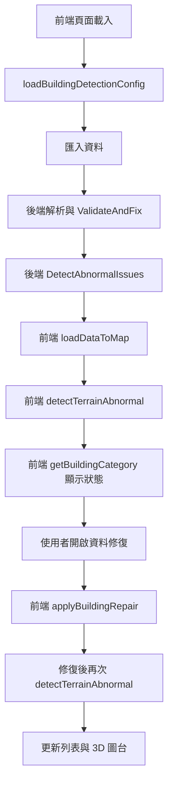

# 資料狀態與修復開發文件

## 文件目的
本文件整理目前專案中「資料狀態判斷」與「資料修復」的既有實作，方便開發者快速理解匯入、檢核、修復與畫面呈現之間的關係。

相關實作主要分布於：

- `Demo_3dDatasCheck_VueTsAspNetCore10.Server/appsettings.json`（異常檢測閾值設定）
- `Demo_3dDatasCheck_VueTsAspNetCore10.Server/Options/BuildingAbnormalDetectionOptions.cs`
- `Demo_3dDatasCheck_VueTsAspNetCore10.Server/Services/BuildingProcessorService.cs`
- `Demo_3dDatasCheck_VueTsAspNetCore10.Server/Controllers/BuildingController.cs`（`GET /api/building/detection-settings`）
- `demo_3ddatascheck_vuetsaspnetcore10.client/src/utils/buildingDetectionConfig.ts`
- `demo_3ddatascheck_vuetsaspnetcore10.client/src/components/BuildingCheckDialog.vue`
- `demo_3ddatascheck_vuetsaspnetcore10.client/src/components/BuildingDemo.vue`
- `demo_3ddatascheck_vuetsaspnetcore10.client/src/components/DataRepairDialog.vue`
- `demo_3ddatascheck_vuetsaspnetcore10.client/src/utils/buildingRepair.ts`
- `demo_3ddatascheck_vuetsaspnetcore10.client/src/types/BuildingPart.ts`

## 1. 核心資料欄位
前端與後端目前沒有共用的狀態列舉，畫面上的狀態名稱是由以下欄位組合推導而成：

- `isAbnormal`：是否被判定為垂直幾何異常（含離地浮空、層高異常、斷層、重疊、倒置等）
- `isValid`：資料是否有效
- `isFixed`：資料是否曾被自動修復或互動修復
- `errorMessages`：異常訊息清單
- `fixMessages`：修復訊息清單

其中前端型別定義位於 `demo_3ddatascheck_vuetsaspnetcore10.client/src/types/BuildingPart.ts`。

## 2. 資料狀態判斷邏輯

### 2.1 狀態來源
畫面上顯示的 `正常`、`異常`、`錯誤`、`已修復`，是由 `demo_3ddatascheck_vuetsaspnetcore10.client/src/components/BuildingCheckDialog.vue` 的 `getBuildingCategory()` 與列表 badge 顯示邏輯決定。

實際判斷順序如下：

1. `isAbnormal === true` 時顯示為 `異常`
2. 否則若 `isFixed === true` 時顯示為 `已修復`
3. 否則若 `isValid === true` 時顯示為 `正常`
4. 其餘情況顯示為 `錯誤`

也就是說，目前 UI 的優先序為：

`異常` > `已修復` > `正常` / `錯誤`

### 2.2 狀態對照表

| 顯示狀態 | 主要條件 | 說明 |
| --- | --- | --- |
| `正常` | `!isAbnormal && isValid && !isFixed` | 資料有效，且未被標記為異常，也沒有修復紀錄 |
| `異常` | `isAbnormal` | 只要被標記為垂直幾何異常，就會優先顯示為異常 |
| `錯誤` | `!isAbnormal && !isFixed && !isValid` | 資料無效，但不屬於異常，也尚未被修復 |
| `已修復` | `!isAbnormal && isFixed` | 曾被後端或前端修復，且目前未被標記為異常 |

### 2.3 正常
`正常` 代表資料沒有被後端或前端檢測為異常，且也沒有修復紀錄。常見來源如下：

- `BuildingProcessorService.ValidateAndFix()` 驗證後未發現缺漏或幾何問題
- `BuildingProcessorService.DetectAbnormalIssues()` 未判定為垂直幾何異常
- `BuildingDemo.detectTerrainAbnormal()` 未因地形高差再次標記為異常

### 2.4 異常
`異常` 對應 `isAbnormal = true`，涵蓋多種垂直幾何異常，包含離地浮空、樓層高度異常、垂直斷層、垂直重疊與樓層高度倒置。

#### 後端會標記為異常的情況
後端在 `Demo_3dDatasCheck_VueTsAspNetCore10.Server/Services/BuildingProcessorService.cs` 中，透過 `DetectAbnormalIssues()` 呼叫以下檢測。閾值由 `appsettings.json` 的 `BuildingAbnormalDetection` 區段設定，並經 `BuildingAbnormalDetectionOptions` 注入服務（修改設定後需重啟後端才會生效）。

| 設定鍵 | 預設值 | 用途 |
| --- | --- | --- |
| `MinFloorHeight` | `2.0` m | 單層高度下限 |
| `MaxFloorHeight` | `8.0` m | 單層高度上限 |
| `GroundFloorBottomThreshold` | `5.0` m | 一般 1 樓底部離地容許上限（疑似浮空） |
| `MaxFloorGap` | `3.0` m | 相鄰樓層垂直斷層落差上限 |
| `FloorGapTolerance` | `0.5` m | 相鄰樓層垂直重疊容許量 |

- `DetectSinglePartAbnormal()`
  - 樓層高度低於 `MinFloorHeight`
  - 樓層高度高於 `MaxFloorHeight`
  - 一般 1 樓底部高度高於 `GroundFloorBottomThreshold`
- `CompareAdjacentFloors()`
  - 相鄰樓層落差大於 `MaxFloorGap`，標記為垂直斷層
  - 相鄰樓層重疊超過 `FloorGapTolerance`，標記為垂直重疊
  - 上層底部低於下層底部，標記為樓層高度倒置

上述情況都會透過 `MarkAbnormal()`：

- 設定 `IsAbnormal = true`
- 設定 `IsValid = false`
- 將異常訊息寫入 `ErrorMessages`

#### 前端會補充標記為異常的情況
前端在 `demo_3ddatascheck_vuetsaspnetcore10.client/src/components/BuildingDemo.vue` 的 `detectTerrainAbnormal()` 中，會使用 Cesium 地形取樣補做一次判斷：

- 若 `建物最低高程 - 地形高度 > 3.0m`（此值目前仍為前端常數 `GROUND_FLOAT_TOLERANCE`，與後端 `BuildingAbnormalDetection` 無關）
- 則由 `markTerrainAbnormal()` 將該筆資料標記為異常

此時也會：

- 設定 `isAbnormal = true`
- 設定 `isValid = false`
- 追加一筆描述地形落差的 `errorMessages`（訊息內容仍可能包含「疑似浮空」等具體描述）

### 2.5 錯誤
`錯誤` 代表資料本身無效，但目前沒有被歸類為異常，也沒有修復完成。這類資料通常來自後端驗證階段的資料品質問題。

常見情況如下：

- `BoundedByRaw` 完全缺漏
- 座標 JSON 解析失敗
- 座標資料只含空值或點數不足
- 座標中含有無效點，過濾後仍留下資料瑕疵

這些情況多由 `ValidateAndFix()` 設定 `IsValid = false`，但不一定會設定 `IsFixed = true`。

### 2.6 已修復
`已修復` 代表資料有修復紀錄，且目前未被標記為異常。

#### 後端自動修復
`ValidateAndFix()` 會在下列情況設定 `IsFixed = true` 並寫入 `FixMessages`：

- 建號缺漏時，自動補成 `UNKNOWN_NO`
- 樓層缺漏時，自動補成 `001`
- 多邊形未閉合時，自動補上終點形成閉合幾何

另外，GeoJSON 匯入流程中的 `GeoJsonSolidInflator.ApplyInflateFixMessages()` 也可能補上修復訊息，表示平面樓板已被轉成可用的 3D 幾何。

#### 前端互動修復
前端在 `demo_3ddatascheck_vuetsaspnetcore10.client/src/utils/buildingRepair.ts` 中執行修復後，也會設定 `isFixed = true` 並追加 `fixMessages`，例如：

- `缺漏樓層補齊：已補齊缺漏樓層`
- `位移修補：已水平對齊參考樓層`
- `位移修補：已垂直對齊鄰層`
- `垂直重疊修補：已上移對齊下層`

## 3. 狀態判斷流程

### 3.1 異常檢測閾值同步
後端與前端修復邏輯共用的垂直連續性閾值（`FloorGapTolerance`、`MaxFloorGap` 等）以 `appsettings.json` 為單一來源：

1. 後端啟動時透過 `IOptions<BuildingAbnormalDetectionOptions>` 綁定 `BuildingAbnormalDetection` 區段
2. 前端在 `BuildingDemo.vue` 的 `onMounted` 呼叫 `loadBuildingDetectionConfig()`，向 `GET /api/building/detection-settings` 取得並快取設定
3. `buildingRepair.ts` 的 `clearResolvedVerticalErrors()`、`applyVerticalOverlapRepair()` 等透過 getter 讀取快取值；API 失敗時使用與後端相同的內建預設值

調整閾值時，請修改 `Demo_3dDatasCheck_VueTsAspNetCore10.Server/appsettings.json` 後重啟後端，並重新載入前端頁面即可同步。

## 4. 資料修復邏輯

### 4.1 修復入口與執行位置
目前修復流程主要在前端執行，沒有獨立的後端修復 API。

執行路徑如下：

1. 使用者在 `BuildingCheckDialog.vue` 開啟 `DataRepairDialog.vue`
2. `DataRepairDialog.vue` 組出 `RepairRequest`
3. `BuildingDemo.vue` 的 `handleRepairBuildings()` 呼叫 `applyBuildingRepair()`
4. 修復完成後重新執行 `detectTerrainAbnormal()`
5. 重新渲染圖台與列表，並顯示修復摘要

### 4.2 修復對象
`DataRepairDialog.vue` 目前只會列出 `isAbnormal === true` 的資料：

- `.filter((b) => b.isAbnormal && b.rowId)`

這代表目前可由互動畫面修復的對象，限於被歸類為 `異常` 的樓層；純 `錯誤` 狀態的資料不會出現在修復清單中。

### 4.3 修復請求欄位
`RepairRequest` 定義於 `demo_3ddatascheck_vuetsaspnetcore10.client/src/utils/buildingRepair.ts`，主要欄位如下：

- `mode`
  - `gapRepair`
  - `displacement`
- `selectedRowIds`：使用者勾選的樓層
- `maxMissingFloors`：缺漏樓層補齊時允許補齊的缺漏層數上限
- `horizontalCorrection`：位移修正是否啟用水平修正
- `verticalCorrection`：位移修正是否啟用垂直修正
- `verticalOverlapCorrection`：位移修正是否啟用垂直重疊修正

## 5. 缺漏樓層補齊邏輯

### 5.1 目的
缺漏樓層補齊對應 `applyGapRepair()`，核心目標是補齊同建號建物中，已選取異常樓層之間的缺漏樓層。

### 5.2 處理流程
`applyGapRepair()` 的處理方式如下：

1. 複製原始建物資料，避免直接污染輸入
2. 只保留 `isAbnormal = true` 且被使用者勾選的樓層
3. 依 `buildingNo` 分組
4. 依樓層排序後，比較相鄰樓層的樓層號碼差距
5. 若樓層之間有缺層，且缺漏數未超過 `maxMissingFloors`，則建立補齊樓層
6. 將新樓層加入結果清單

### 5.3 補齊樓層建立方式
補齊樓層由 `createPatchedBuilding()` 建立，主要特性如下：

- 以鄰近已選取樓層作為幾何模板
- 複製原有座標後，透過 `shiftCoordinatesZ()` 線性調整高度
- 樓層名稱會格式化為三位數，例如 `001`
- 新增資料會直接標記為：
  - `isValid = true`
  - `isFixed = true`
  - `isAbnormal = false`
- 修復訊息會寫入 `缺漏樓層補齊：已補齊缺漏樓層 XXX`

### 5.4 高度推算方式
補齊缺漏樓層時，程式會以：

- 下層的 `maxHeight`
- 上層的 `minHeight`

作為區間，平均切分為多個樓層高度槽位。若無法合理推算，則使用預設層高 `3.0m`。

### 5.5 跳過條件
以下情況不會補齊：

- 缺漏樓層數小於等於 `0`
- 缺漏樓層數大於 `maxMissingFloors`
- 樓層字串無法解析為可排序的正整數

修復摘要中會統計：

- `insertedCount`：實際補齊筆數
- `skippedGaps`：因超過上限而跳過的缺漏區段數

## 6. 位移修正邏輯

### 6.1 目的
位移修正對應 `applyDisplacementRepair()`，用來處理已標記為異常的樓層位置偏移問題。它可以依使用者勾選，分別執行：

- 水平修正
- 垂直重疊修正
- 垂直修正

### 6.2 執行順序
`applyDisplacementRepair()` 固定依下列順序執行：

1. 水平修正
2. 垂直重疊修正
3. 垂直修正

這個順序的目的是先調整平面位置，再解決相鄰樓層的重疊與堆疊問題。

### 6.3 水平修正
水平修正由 `applyHorizontalDisplacementRepair()` 執行，邏輯如下：

1. 只處理 `isAbnormal = true` 且被選取的樓層
2. 在同一 `buildingNo` 中尋找非異常樓層作為參考樓層
3. 以目標樓層與參考樓層的質心差，計算平移量
4. 若平移距離大於 `100m`，則忽略該參考樓層
5. 計算平移後 footprint 與參考樓層 footprint 的重疊比例
6. 選擇重疊比例最高的參考方案
7. 只有當重疊比例至少達到 `0.5` 才套用修復

修復成功後會：

- 平移經緯度，不改變 Z 值
- 重新計算高度範圍
- 設定 `isFixed = true`
- 寫入 `位移修補：已水平對齊參考樓層`

### 6.4 垂直重疊修正
垂直重疊修正由 `applyVerticalOverlapRepair()` 執行，目標是解決相鄰樓層在 Z 軸上的重疊。

處理方式如下：

1. 依建號分組並按樓層排序
2. 逐組檢查相鄰樓層是否出現 `gap < -FloorGapTolerance`（閾值與後端 `BuildingAbnormalDetection.FloorGapTolerance` 同步，預設 `-0.5m`）
3. 若上層為已選取異常樓層，則上移上層使其底部貼齊下層頂部
4. 否則若下層為已選取異常樓層，則下移下層使其頂部貼齊上層底部

修復成功後會：

- 調整整個樓層的 Z 值
- 設定 `isFixed = true`
- 寫入 `垂直重疊修補` 訊息

之後會呼叫 `clearResolvedVerticalErrors()`，重新檢查是否可以移除已解決的垂直異常訊息。

### 6.5 垂直修正
垂直修正由 `applyVerticalDisplacementRepair()` 執行，目標是讓異常樓層沿 Z 軸對齊相鄰的正常樓層。

處理邏輯如下：

1. 解析目前樓層號碼
2. 在同建號資料中尋找前一層與下一層的非異常參考樓層
3. 若上下參考樓層都存在，且中間可容納目前樓層高度，則優先使用上下鄰層夾出的空間
4. 若只有下層存在，則將本樓層底部對齊下層頂部
5. 若只有上層存在，則將本樓層頂部對齊上層底部

修復成功後會：

- 整體平移 Z 值
- 重新計算高度範圍
- 設定 `isFixed = true`
- 寫入 `位移修補：已垂直對齊鄰層`

最後同樣會由 `clearResolvedVerticalErrors()` 重新檢查並清除已解決的垂直異常。

### 6.6 清除已解決垂直異常
`clearResolvedVerticalErrors()` 會重新檢查同建號相鄰樓層的垂直關係，並依 `FloorGapTolerance`、`MaxFloorGap`（來自 `buildingDetectionConfig`）判斷是否可移除以下訊息：

- `垂直重疊`
- `垂直斷層`
- `樓層高度倒置`

若某筆資料的 `errorMessages` 被清空，則會同步：

- 設定 `isAbnormal = false`
- 設定 `isValid = true`

這也是某些資料從 `異常` 轉為 `已修復` 或 `正常` 的關鍵步驟。

## 7. 修復完成後的後續處理
在 `BuildingDemo.vue` 的 `handleRepairBuildings()` 中，前端會在修復後：

1. 以修復結果覆蓋目前 `buildings`
2. 補齊 `rowId`、`errorMessages`、`fixMessages`
3. 再次執行 `detectTerrainAbnormal()`
4. 重新渲染 3D 建物
5. 顯示修復摘要對話框

這表示即使某筆資料剛完成幾何修復，只要它仍然與地形高差過大，仍可能再次被標記為 `異常`。

## 8. 目前實作限制與注意事項

### 8.1 `isAbnormal` 的語意範圍
`isAbnormal` 涵蓋以下垂直幾何異常類型：

- 離地浮空（含地形落差檢測）
- 樓層高度異常
- 垂直斷層
- 垂直重疊
- 樓層高度倒置

畫面顯示的「異常」與程式欄位 `isAbnormal` 已一致；`errorMessages` 中的具體描述（如「疑似浮空」）則保留各異常類型的細節說明。

### 8.2 修復主要在前端
目前互動式修復流程完全在前端完成，後端負責的修復僅限於匯入階段的基本清理與自動補值。

### 8.3 `已修復` 不一定代表完全無問題
只要 `isFixed = true` 且 `isAbnormal = false`，畫面就會顯示為 `已修復`。若資料曾經被自動補值或幾何補強，即使原先存在錯誤，也可能直接歸類為 `已修復`。

### 8.4 修復後仍可能回到異常
修復完成後會再次進行地形異常檢測（`detectTerrainAbnormal`），因此原本已修復的資料仍可能因地形落差被重新標記為 `異常`。

### 8.5 修復清單不包含純錯誤資料
`DataRepairDialog.vue` 只列出 `isAbnormal` 資料，因此僅有 `錯誤` 而非 `異常` 的資料，無法透過目前的資料修復對話框處理。
